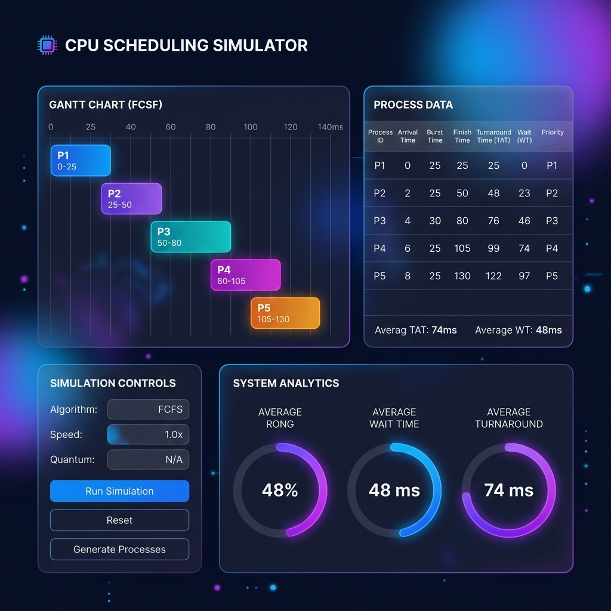

# 🧠 CPU Scheduler Simulator

[](https://reactjs.org/)
[](https://vitejs.dev/)
[](https://tailwindcss.com/)
[](https://www.framer.com/motion/)

A powerful, interactive web-based simulator designed to visualize and compare various CPU scheduling algorithms. Built with a modern tech stack focusing on performance and aesthetics.



## ✨ Features

- **Multiple Algorithms**: Comprehensive support for:
  - First Come First Serve (FCFS)
  - Shortest Job First (SJF) - Non-preemptive & Preemptive (SRTF)
  - Priority Scheduling - Non-preemptive & Preemptive
  - Round Robin (RR) with adjustable Time Quantum
  - Highest Response Ratio Next (HRRN)
  - Longest Job First (LJF) - Non-preemptive
  - Longest Remaining Time First (LRTF) - Preemptive LJF
- **Interactive Visualization**: Real-time Gantt chart generation for process execution timelines.
- **Deep Analytics**: Detailed metrics including Average Waiting Time, Turnaround Time, Response Time, CPU Utilization, and Throughput.
- **Algorithm Comparison**: Side-by-side comparison mode to determine the most efficient algorithm for a given set of processes.
- **Data Portability**: Export results to CSV and save/load process configurations via JSON.
- **Algorithm Descriptions**: Integrated hints and explanations for each scheduling strategy.
- **Modern UI/UX**: Dark mode support, fluid animations, and a responsive design.

## 🛠️ Tech Stack

- **Frontend**: React 18
- **Build Tool**: Vite
- **Styling**: TailwindCSS & Custom CSS Variables
- **Animations**: Framer Motion
- **Icons**: Lucide React

## 🚀 Getting Started

### Prerequisites

- Node.js (v16.0 or higher)
- npm or yarn

### Installation

1. Clone the repository:
   ```bash
   git clone https://github.com/Atharvasingh17/cpu-scheduler-simulator.git
   ```
2. Navigate to the project directory:
   ```bash
   cd cpu-scheduler-simulator
   ```
3. Install dependencies:
   ```bash
   npm install
   ```
4. Start the development server:
   ```bash
   npm run dev
   ```

## 📈 Usage

1. **Configure Processes**: Add processes by specifying Arrival Time, Burst Time, and Priority.
2. **Select Algorithm**: Choose an algorithm from the dropdown menu.
3. **Run Simulation**: Click "Run Simulation" to see the Gantt chart and calculated metrics.
4. **Compare**: Use "Compare All Algorithms" to see how different strategies perform on the same dataset.

## 📄 License

This project is licensed under the MIT License.
