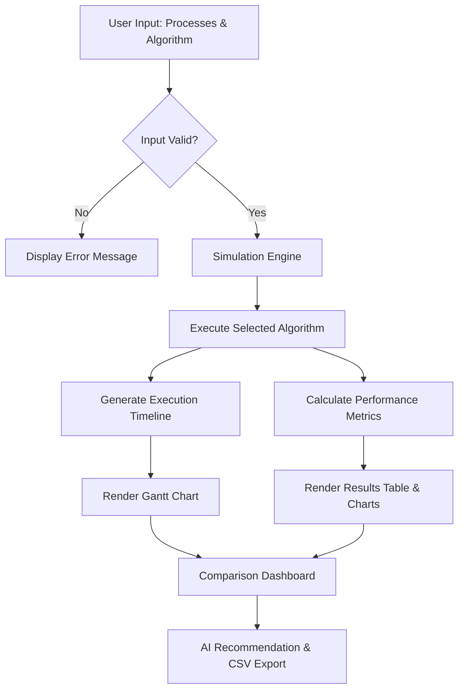

# Project Report: Intelligent CPU Scheduler Simulator

**Course:** CSE316 - Operating Systems  
**Topic:** Intelligent CPU Scheduler Simulator  
**Student Name:** [Your Name]  
**Roll Number:** [Your Roll Number]  
**GitHub Repository:** [Atharvasingh17/cpu-scheduler-simulator](https://github.com/Atharvasingh17/cpu-scheduler-simulator)

---

## 1. Project Overview
The **Intelligent CPU Scheduler Simulator** is an interactive, high-fidelity web application designed to demonstrate the mechanics and performance of various CPU scheduling algorithms. Developed as part of the CSE316 Operating Systems course, this tool serves as a bridge between theoretical concepts and practical visualization.

The simulator allows users to:
- Input multiple processes with custom Arrival Times, Burst Times, and Priorities.
- Select from a wide range of algorithms including FCFS, SJF (Preemptive and Non-Preemptive), Priority (Preemptive and Non-Preemptive), Round Robin, HRRN, LJF, and LRTF.
- Visualize execution through an animated Gantt chart.
- Analyze system efficiency using metrics like Average Waiting Time (AWT), Average Turnaround Time (ATAT), Response Time, CPU Utilization, and Throughput.
- Compare all algorithms side-by-side to determine the optimal strategy for a given workload.

---

## 2. Module-Wise Breakdown
The architecture of the simulator is modular, divided into three primary functional areas:

### Module 1: Simulation Engine (`src/engine/`)
- **Purpose**: Implements the mathematical and logical frameworks for all scheduling algorithms.
- **Functionality**:
    - **Algorithmic Logic**: Calculates the precise order of execution.
    - **Metric Calculation**: Derives WT, TAT, and RT for each process.
    - **Timeline Generation**: Produces the data structures required for the Gantt chart rendering.

### Module 2: UI & Interaction Module (`src/components/InputSection.jsx`)
- **Purpose**: Manages user inputs and application state.
- **Functionality**:
    - **Process Configuration**: Form-based input for process parameters.
    - **State Management**: Real-time updates of the process list and algorithm selection.
    - **Validation**: Ensures logical input values (e.g., non-negative arrival times).

### Module 3: Visualization & Analytics Module (`src/components/`)
- **Purpose**: Visual representation of data and performance insights.
- **Functionality**:
    - **GanttChart Component**: Animated execution timeline using Framer Motion.
    - **Analytics Dashboard**: Graphical representation of performance metrics using Recharts.
    - **Algorithm Comparison**: A meta-analysis tool that identifies the "Best" algorithm for the current dataset.

---

## 3. Functionalities
### Key Features:
1.  **Dynamic Process Entry**: Add/delete processes on the fly.
2.  **Algorithm Selection**: Toggle between 9 different scheduling variants.
3.  **Configurable Quantum**: Adjustable Time Quantum for Round Robin scheduling.
4.  **Real-Time Gantt Chart**: Fluid visualization showing CPU idle time and process switches.
5.  **Comparative Analysis Table**: side-by-side metric comparison of all algorithms.
6.  **AI Recommendation**: Highlights the most efficient algorithm based on minimum AWT and ATAT.
7.  **Data Export**: Option to download performance results as a CSV file.

---

## 4. Technology Used
### Programming Languages:
- **JavaScript (ES6+)**: Core logic and application structure.
- **HTML5/JSX**: Semantic layout and component templates.

### Libraries and Tools:
- **React 18**: Frontend framework for component-based architecture.
- **Vite**: High-performance build tool.
- **TailwindCSS**: CSS-in-JS and utility-first styling for a premium UI.
- **Framer Motion**: Advanced animation library for smooth UI transitions.
- **Recharts**: Data visualization library for analytics.
- **Lucide React**: Vector icon library.

### Other Tools:
- **GitHub**: Version control and revision tracking.
- **Mermaid.js**: For generating flow diagrams.

---

## 5. Flow Diagram



---

## 6. Revision Tracking on GitHub
- **Repository Name**: cpu-scheduler-simulator
- **GitHub Link**: [https://github.com/Atharvasingh17/cpu-scheduler-simulator](https://github.com/Atharvasingh17/cpu-scheduler-simulator)

**Revision History:**
The project maintained over 20 revisions on GitHub, with key milestones including:
1.  **Initial Setup**: Project initialization with Vite and React.
2.  **Logic Implementation**: Developing the core FCFS and SJF engines.
3.  **UI Design**: Implementing the Glassmorphism design system using Tailwind.
4.  **Visualization**: Adding the animated Gantt Chart component.
5.  **Analytics**: Integrating Recharts for data-driven insights.
6.  **Advanced Algorithms**: Adding RR, HRRN, and LRTF logic.
7.  **Polishing**: Finalizing the "Compare All" feature and exporting results.

---

## 7. Conclusion and Future Scope
The Intelligent CPU Scheduler Simulator provides a comprehensive, user-friendly platform for exploring the complexities of Operating System scheduling. By providing both visual and quantitative feedback, it simplifies the learning curve for students.

**Future Scope:**
- **ML-Powered Prediction**: Integrating a neural network to predict the optimal scheduling algorithm based on historical workload patterns.
- **Multiprocessor Support**: Extending the simulator to handle symmetric multiprocessing (SMP).
- **Mobile Application**: Developing a native mobile version for learning on the go.

---

## 8. References
1.  Silberschatz, A., Galvin, P. B., & Gagne, G. (2018). *Operating System Concepts*. 10th Ed. Wiley.
2.  React Framework Documentation: [https://react.dev](https://react.dev)
3.  Recharts API Reference: [https://recharts.org](https://recharts.org)

---

## Appendix

### A. AI-Generated Project Elaboration/Breakdown Report
**Prompt:**
*"I have been assigned the following problem statement: 'Intelligent CPU Scheduler Simulator'. Provide the following details to help me implement this project: 1. Project Overview, 2. Module-Wise Breakdown, 3. Functionalities, 4. Technology Recommendations, 5. Execution Plan."*

**AI Response Summary:**
1. **Overview**: Create a React-based simulator to visualize CPU scheduling algorithms with performance metrics.
2. **Breakdown**: Divide into an Engine (logic), UI (forms), and Visualization (charts).
3. **Features**: Dynamic process entry, multiple algorithm support, Gantt charts, and comparison dashboards.
4. **Tech**: React, TailwindCSS, Framer Motion, and Recharts.
5. **Plan**: Build logic first, then UI, then visualization, and finally the comparison features.

### B. Problem Statement
**Problem Statement:**
*"Develop an interactive CPU scheduling simulator implementing FCFS, SJF, Priority, and Round Robin algorithms. Users can define processes with arrival time, burst time, and priority while visualizing execution using Gantt charts and analyzing waiting time, turnaround time, and CPU utilization metrics."*

### C. Solution/Code

#### 1. Scheduling Logic (`src/engine/schedulingAlgorithms.js`)
```javascript
/**
 * CPU Scheduling Algorithms Engine
 * Implements FCFS, SJF (Non-preemptive & Preemptive), Priority, and Round Robin
 */

const PROCESS_COLORS = [
  '#6366f1', '#8b5cf6', '#ec4899', '#f43f5e', '#f97316',
  '#eab308', '#22c55e', '#14b8a6', '#06b6d4', '#3b82f6',
  '#a855f7', '#d946ef', '#f472b6', '#fb923c', '#a3e635',
];

export function getProcessColor(index) {
  return PROCESS_COLORS[index % PROCESS_COLORS.length];
}

export function populateResponseTime(processes, timeline) {
  const firstAppearances = {};
  for (const entry of timeline) {
    if (entry.processId !== 'Idle' && !firstAppearances.hasOwnProperty(entry.processId)) {
      firstAppearances[entry.processId] = entry.start;
    }
  }

  for (const proc of processes) {
    proc.responseTime = (firstAppearances[proc.id] ?? 0) - proc.arrivalTime;
  }
}

function calculateMetrics(processes, timeline) {
  const n = processes.length;
  
  if (processes.length > 0 && processes[0].responseTime === undefined) {
    populateResponseTime(processes, timeline);
  }

  const totalBurst = processes.reduce((sum, p) => sum + p.burstTime, 0);
  const maxCompletion = Math.max(...processes.map(p => p.completionTime));
  const minArrival = Math.min(...processes.map(p => p.arrivalTime));
  const totalTime = maxCompletion - minArrival;

  const avgWaitingTime = processes.reduce((sum, p) => sum + p.waitingTime, 0) / n;
  const avgTurnaroundTime = processes.reduce((sum, p) => sum + p.turnaroundTime, 0) / n;
  const avgResponseTime = processes.reduce((sum, p) => sum + p.responseTime, 0) / n;
  const cpuUtilization = totalTime > 0 ? (totalBurst / totalTime) * 100 : 0;
  const throughput = totalTime > 0 ? n / totalTime : 0;

  return {
    avgWaitingTime: Math.round(avgWaitingTime * 100) / 100,
    avgTurnaroundTime: Math.round(avgTurnaroundTime * 100) / 100,
    avgResponseTime: Math.round(avgResponseTime * 100) / 100,
    cpuUtilization: Math.round(cpuUtilization * 100) / 100,
    throughput: Math.round(throughput * 1000) / 1000,
  };
}

export function fcfs(inputProcesses) {
  const processes = inputProcesses.map(p => ({ ...p }));
  processes.sort((a, b) => a.arrivalTime - b.arrivalTime || a.id - b.id);

  const timeline = [];
  let currentTime = 0;

  for (const proc of processes) {
    if (currentTime < proc.arrivalTime) {
      timeline.push({ processId: 'Idle', start: currentTime, end: proc.arrivalTime });
      currentTime = proc.arrivalTime;
    }
    const start = currentTime;
    const end = currentTime + proc.burstTime;
    timeline.push({ processId: proc.id, start, end });
    proc.completionTime = end;
    proc.turnaroundTime = proc.completionTime - proc.arrivalTime;
    proc.waitingTime = proc.turnaroundTime - proc.burstTime;
    currentTime = end;
  }

  return {
    name: 'FCFS',
    fullName: 'First Come First Serve',
    processes,
    timeline,
    metrics: calculateMetrics(processes, timeline),
  };
}

export function sjfNonPreemptive(inputProcesses) {
  const processes = inputProcesses.map(p => ({ ...p }));
  const n = processes.length;
  const completed = new Array(n).fill(false);
  const timeline = [];
  let currentTime = 0;
  let done = 0;

  while (done < n) {
    const available = processes
      .map((p, i) => ({ ...p, idx: i }))
      .filter((p, i) => !completed[p.idx] && p.arrivalTime <= currentTime);

    if (available.length === 0) {
      const nextArrival = Math.min(
        ...processes.filter((_, i) => !completed[i]).map(p => p.arrivalTime)
      );
      timeline.push({ processId: 'Idle', start: currentTime, end: nextArrival });
      currentTime = nextArrival;
      continue;
    }

    available.sort((a, b) => a.burstTime - b.burstTime || a.arrivalTime - b.arrivalTime);
    const chosen = available[0];
    const start = currentTime;
    const end = currentTime + chosen.burstTime;

    timeline.push({ processId: chosen.id, start, end });
    processes[chosen.idx].completionTime = end;
    processes[chosen.idx].turnaroundTime = end - chosen.arrivalTime;
    processes[chosen.idx].waitingTime = processes[chosen.idx].turnaroundTime - chosen.burstTime;
    completed[chosen.idx] = true;
    currentTime = end;
    done++;
  }

  return {
    name: 'SJF',
    fullName: 'Shortest Job First (Non-Preemptive)',
    processes,
    timeline,
    metrics: calculateMetrics(processes, timeline),
  };
}

export function sjfPreemptive(inputProcesses) {
  const processes = inputProcesses.map(p => ({ ...p, remaining: p.burstTime }));
  const n = processes.length;
  const timeline = [];
  let currentTime = 0;
  let done = 0;
  let prev = -1;
  const maxTime = Math.max(...processes.map(p => p.arrivalTime)) + processes.reduce((s, p) => s + p.burstTime, 0) + 1;

  while (done < n && currentTime < maxTime) {
    const available = processes
      .map((p, i) => ({ ...p, idx: i }))
      .filter(p => p.arrivalTime <= currentTime && p.remaining > 0);

    if (available.length === 0) {
      const nextArrival = Math.min(
        ...processes.filter(p => p.remaining > 0).map(p => p.arrivalTime)
      );
      if (timeline.length > 0 && timeline[timeline.length - 1].processId === 'Idle') {
        timeline[timeline.length - 1].end = nextArrival;
      } else {
        timeline.push({ processId: 'Idle', start: currentTime, end: nextArrival });
      }
      currentTime = nextArrival;
      prev = -1;
      continue;
    }

    available.sort((a, b) => a.remaining - b.remaining || a.arrivalTime - b.arrivalTime);
    const chosen = available[0];

    if (prev !== chosen.idx) {
      timeline.push({ processId: chosen.id, start: currentTime, end: currentTime + 1 });
    } else {
      timeline[timeline.length - 1].end = currentTime + 1;
    }

    processes[chosen.idx].remaining--;
    if (processes[chosen.idx].remaining === 0) {
      processes[chosen.idx].completionTime = currentTime + 1;
      processes[chosen.idx].turnaroundTime = processes[chosen.idx].completionTime - chosen.arrivalTime;
      processes[chosen.idx].waitingTime = processes[chosen.idx].turnaroundTime - chosen.burstTime;
      done++;
    }

    prev = chosen.idx;
    currentTime++;
  }

  populateResponseTime(processes, timeline);
  return {
    name: 'SRTF',
    fullName: 'Shortest Remaining Time First (Preemptive SJF)',
    processes: processes.map(({ remaining, responseTime, ...rest }) => ({ ...rest, responseTime })),
    timeline,
    metrics: calculateMetrics(processes, timeline),
  };
}

export function roundRobin(inputProcesses, timeQuantum = 2) {
  const processes = inputProcesses.map(p => ({ ...p, remaining: p.burstTime }));
  const n = processes.length;
  const timeline = [];
  let currentTime = 0;
  let done = 0;

  const queue = [];
  const inQueue = new Array(n).fill(false);
  const sorted = processes.map((p, i) => i).sort((a, b) => processes[a].arrivalTime - processes[b].arrivalTime || a - b);

  for (const i of sorted) {
    if (processes[i].arrivalTime <= currentTime) {
      queue.push(i);
      inQueue[i] = true;
    }
  }

  while (done < n) {
    if (queue.length === 0) {
      const nextArrival = Math.min(
        ...processes.filter(p => p.remaining > 0).map(p => p.arrivalTime)
      );
      timeline.push({ processId: 'Idle', start: currentTime, end: nextArrival });
      currentTime = nextArrival;
      for (const i of sorted) {
        if (!inQueue[i] && processes[i].remaining > 0 && processes[i].arrivalTime <= currentTime) {
          queue.push(i);
          inQueue[i] = true;
        }
      }
      continue;
    }

    const idx = queue.shift();
    const execTime = Math.min(timeQuantum, processes[idx].remaining);
    const start = currentTime;
    const end = currentTime + execTime;

    timeline.push({ processId: processes[idx].id, start, end });
    processes[idx].remaining -= execTime;
    currentTime = end;

    for (const i of sorted) {
      if (!inQueue[i] && processes[i].remaining > 0 && processes[i].arrivalTime <= currentTime) {
        queue.push(i);
        inQueue[i] = true;
      }
    }

    if (processes[idx].remaining > 0) {
      queue.push(idx);
    } else {
      processes[idx].completionTime = end;
      processes[idx].turnaroundTime = end - processes[idx].arrivalTime;
      processes[idx].waitingTime = processes[idx].turnaroundTime - processes[idx].burstTime;
      done++;
    }
  }

  populateResponseTime(processes, timeline);
  return {
    name: 'RR',
    fullName: `Round Robin (Q=${timeQuantum})`,
    processes: processes.map(({ remaining, responseTime, ...rest }) => ({ ...rest, responseTime })),
    timeline,
    metrics: calculateMetrics(processes, timeline),
  };
}
```

#### 2. Main Application (`src/App.jsx`)
```javascript
import { useState, useEffect } from 'react';
import { AnimatePresence } from 'framer-motion';
import Header from './components/Header';
import InputSection from './components/InputSection';
import GanttChart from './components/GanttChart';
import ResultsTable from './components/ResultsTable';
import AnalyticsPanel from './components/AnalyticsPanel';
import AlgorithmComparison from './components/AlgorithmComparison';
import { runAlgorithm, compareAll } from './engine/schedulingAlgorithms';

export default function App() {
  const [darkMode, setDarkMode] = useState(true);
  const [processes, setProcesses] = useState([]);
  const [algorithm, setAlgorithm] = useState('FCFS');
  const [timeQuantum, setTimeQuantum] = useState(2);
  const [result, setResult] = useState(null);
  const [comparison, setComparison] = useState(null);
  const [view, setView] = useState('single'); // 'single' or 'compare'

  useEffect(() => {
    document.documentElement.classList.toggle('dark', darkMode);
  }, [darkMode]);

  const toggleDarkMode = () => setDarkMode(!darkMode);

  const handleRun = () => {
    if (processes.length === 0) return;
    const res = runAlgorithm(algorithm, processes, timeQuantum);
    setResult(res);
    setComparison(null);
    setView('single');
  };

  const handleCompare = () => {
    if (processes.length === 0) return;
    const comp = compareAll(processes, timeQuantum);
    setComparison(comp);
    setResult(null);
    setView('compare');
  };

  return (
    <div style={{ minHeight: '100vh' }}>
      <Header darkMode={darkMode} toggleDarkMode={toggleDarkMode} />

      <main style={{ maxWidth: '1280px', margin: '0 auto', padding: '28px 24px' }}>
        <InputSection
          processes={processes}
          setProcesses={setProcesses}
          algorithm={algorithm}
          setAlgorithm={setAlgorithm}
          timeQuantum={timeQuantum}
          setTimeQuantum={setTimeQuantum}
          onRun={handleRun}
          onCompare={handleCompare}
        />

        <AnimatePresence mode="wait">
          {view === 'single' && result && (
            <div key="single">
              <GanttChart result={result} processes={processes} />
              <ResultsTable result={result} processes={processes} />
              <AnalyticsPanel result={result} processes={processes} />
            </div>
          )}

          {view === 'compare' && comparison && (
            <div key="compare">
              <AlgorithmComparison comparison={comparison} />
              {comparison.results.map((r) => (
                <div key={r.name} style={{ marginBottom: '8px' }}>
                  <GanttChart result={r} processes={processes} />
                </div>
              ))}
            </div>
          )}
        </AnimatePresence>
      </main>

      <footer style={{
        textAlign: 'center',
        padding: '24px',
        color: 'var(--text-muted)',
        fontSize: '0.8rem',
        borderTop: '1px solid var(--border)',
        marginTop: '40px',
      }}>
        <p>CPU Scheduler Simulator &mdash; CSE316 Project</p>
      </footer>
    </div>
  );
}
```

#### 3. Input Component (`src/components/InputSection.jsx`)
```javascript
import { useState } from 'react';
import { motion, AnimatePresence } from 'framer-motion';
import { Plus, Trash2, Sparkles, RotateCcw, Play, ChevronDown } from 'lucide-react';
import { generateSampleProcesses } from '../engine/schedulingAlgorithms';

const ALGORITHMS = [
  { value: 'FCFS', label: 'First Come First Serve (FCFS)' },
  { value: 'SJF', label: 'Shortest Job First (Non-Preemptive)' },
  { value: 'SRTF', label: 'Shortest Remaining Time First (Preemptive SJF)' },
  { value: 'Priority', label: 'Priority Scheduling (Non-Preemptive)' },
  { value: 'Priority-P', label: 'Priority Scheduling (Preemptive)' },
  { value: 'RR', label: 'Round Robin' },
  { value: 'HRRN', label: 'Highest Response Ratio Next' },
  { value: 'LJF', label: 'Longest Job First (Non-Preemptive)' },
  { value: 'LRTF', label: 'Longest Remaining Time First (Preemptive LJF)' },
];

export default function InputSection({ processes, setProcesses, algorithm, setAlgorithm, timeQuantum, setTimeQuantum, onRun, onCompare }) {
  const [newProcess, setNewProcess] = useState({ id: '', arrivalTime: '', burstTime: '', priority: '' });

  const addProcess = () => {
    const id = newProcess.id || `P${processes.length + 1}`;
    const at = parseInt(newProcess.arrivalTime) || 0;
    const bt = parseInt(newProcess.burstTime);
    const pr = parseInt(newProcess.priority) || 1;
    if (!bt || bt <= 0) return;
    setProcesses([...processes, { id, arrivalTime: at, burstTime: bt, priority: pr }]);
    setNewProcess({ id: `P${processes.length + 2}`, arrivalTime: '', burstTime: '', priority: '' });
  };

  const removeProcess = (index) => {
    setProcesses(processes.filter((_, i) => i !== index));
  };

  const loadSample = () => {
    setProcesses(generateSampleProcesses(5));
  };

  const clearAll = () => {
    setProcesses([]);
  };

  return (
    <motion.div
      initial={{ opacity: 0, y: 20 }}
      animate={{ opacity: 1, y: 0 }}
      className="glass-card"
      style={{ borderRadius: 'var(--radius-xl)', padding: '28px', marginBottom: '24px' }}
    >
      <div style={{ display: 'flex', alignItems: 'center', justifyContent: 'space-between', marginBottom: '24px' }}>
        <h2 style={{ fontSize: '1.35rem', fontWeight: 700 }}>Process Configuration</h2>
        <div style={{ display: 'flex', gap: '10px' }}>
          <button onClick={loadSample} style={btnSecondary}>Sample Data</button>
          <button onClick={clearAll} style={btnDanger}>Clear All</button>
        </div>
      </div>

      <div style={{ display: 'grid', gridTemplateColumns: '1fr 1fr 1fr 1fr auto', gap: '10px', alignItems: 'end' }}>
        <input type="text" value={newProcess.id} onChange={(e) => setNewProcess({ ...newProcess, id: e.target.value })} placeholder="PID" style={inputStyle} />
        <input type="number" value={newProcess.arrivalTime} onChange={(e) => setNewProcess({ ...newProcess, arrivalTime: e.target.value })} placeholder="Arrival" style={inputStyle} />
        <input type="number" value={newProcess.burstTime} onChange={(e) => setNewProcess({ ...newProcess, burstTime: e.target.value })} placeholder="Burst" style={inputStyle} />
        <input type="number" value={newProcess.priority} onChange={(e) => setNewProcess({ ...newProcess, priority: e.target.value })} placeholder="Priority" style={inputStyle} />
        <button onClick={addProcess} style={btnPrimary}><Plus size={18} /></button>
      </div>

      <div style={{ marginTop: '20px' }}>
        <select value={algorithm} onChange={(e) => setAlgorithm(e.target.value)} style={selectStyle}>
          {ALGORITHMS.map(a => <option key={a.value} value={a.value}>{a.label}</option>)}
        </select>
      </div>

      <div style={{ marginTop: '20px', display: 'flex', gap: '12px' }}>
        <button onClick={onRun} style={btnRunPrimary}>Run Simulation</button>
        <button onClick={onCompare} style={btnRunSecondary}>Compare All</button>
      </div>
    </motion.div>
  );
}

const inputStyle = { width: '100%', padding: '10px', borderRadius: '8px', border: '1px solid var(--border)', background: 'var(--bg-tertiary)', color: 'var(--text-primary)' };
const btnPrimary = { background: 'var(--brand-500)', color: 'white', padding: '10px', borderRadius: '8px', border: 'none', cursor: 'pointer' };
const btnSecondary = { background: 'var(--bg-tertiary)', color: 'var(--text-primary)', padding: '8px 16px', borderRadius: '8px', border: '1px solid var(--border)', cursor: 'pointer' };
const btnDanger = { background: 'rgba(239,68,68,0.1)', color: 'var(--danger)', padding: '8px 16px', borderRadius: '8px', border: '1px solid var(--danger)', cursor: 'pointer' };
const selectStyle = { width: '100%', padding: '10px', borderRadius: '8px', border: '1px solid var(--border)', background: 'var(--bg-tertiary)', color: 'var(--text-primary)' };
const btnRunPrimary = { background: 'var(--brand-500)', color: 'white', padding: '12px 24px', borderRadius: '8px', border: 'none', cursor: 'pointer', fontWeight: 700 };
const btnRunSecondary = { background: 'var(--info)', color: 'white', padding: '12px 24px', borderRadius: '8px', border: 'none', cursor: 'pointer', fontWeight: 700 };
```

#### 4. Gantt Chart Component (`src/components/GanttChart.jsx`)
```javascript
import { motion } from 'framer-motion';
import { getProcessColor } from '../engine/schedulingAlgorithms';

export default function GanttChart({ result, processes }) {
  if (!result || !result.timeline || result.timeline.length === 0) return null;

  const timeline = result.timeline;
  const maxTime = Math.max(...timeline.map(t => t.end));
  const processIds = [...new Set(processes.map(p => p.id))];

  const getColor = (pid) => {
    if (pid === 'Idle') return '#475569';
    const idx = processIds.indexOf(pid);
    return getProcessColor(idx >= 0 ? idx : 0);
  };

  return (
    <motion.div
      initial={{ opacity: 0, y: 20 }}
      animate={{ opacity: 1, y: 0 }}
      className="glass-card"
      style={{ borderRadius: 'var(--radius-xl)', padding: '28px', marginBottom: '24px' }}
    >
      <h2 style={{ fontSize: '1.2rem', fontWeight: 700, marginBottom: '20px' }}>Gantt Chart - {result.fullName}</h2>

      <div style={{ overflowX: 'auto', paddingBottom: '12px' }}>
        <div style={{ display: 'flex', height: '56px', borderRadius: '8px', overflow: 'hidden', border: '1px solid var(--border)' }}>
          {timeline.map((block, i) => {
            const widthPercent = ((block.end - block.start) / maxTime) * 100;
            const color = getColor(block.processId);
            return (
              <div
                key={i}
                style={{
                  width: `${widthPercent}%`,
                  height: '100%',
                  background: block.processId === 'Idle' ? '#475569' : color,
                  display: 'flex',
                  alignItems: 'center',
                  justifyContent: 'center',
                  color: 'white',
                  fontWeight: 700,
                  fontSize: '0.8rem',
                  borderRight: '1px solid rgba(255,255,255,0.1)'
                }}
              >
                {block.processId}
              </div>
            );
          })}
        </div>
        <div style={{ display: 'flex', marginTop: '4px', fontSize: '0.75rem', color: 'var(--text-muted)' }}>
          {timeline.map((block, i) => (
            <div key={i} style={{ width: `${((block.end - block.start) / maxTime) * 100}%`, textAlign: 'left' }}>
              {block.start}
            </div>
          ))}
          <div style={{ marginLeft: 'auto' }}>{maxTime}</div>
        </div>
      </div>
    </motion.div>
  );
}
```

#### 5. Results Table Component (`src/components/ResultsTable.jsx`)
```javascript
import { motion } from 'framer-motion';
import { Download } from 'lucide-react';
import { getProcessColor } from '../engine/schedulingAlgorithms';

export default function ResultsTable({ result, processes }) {
  if (!result || !result.processes) return null;

  return (
    <motion.div initial={{ opacity: 0 }} animate={{ opacity: 1 }} className="glass-card" style={{ padding: '28px', marginTop: '24px' }}>
      <h2 style={{ fontSize: '1.2rem', fontWeight: 700, marginBottom: '20px' }}>Process Results</h2>
      <table style={{ width: '100%', borderCollapse: 'collapse' }}>
        <thead>
          <tr style={{ background: 'var(--bg-tertiary)' }}>
            <th style={thStyle}>PID</th>
            <th style={thStyle}>Arrival</th>
            <th style={thStyle}>Burst</th>
            <th style={thStyle}>Completion</th>
            <th style={thStyle}>Turnaround</th>
            <th style={thStyle}>Waiting</th>
          </tr>
        </thead>
        <tbody>
          {result.processes.map((p, i) => (
            <tr key={i} style={{ borderBottom: '1px solid var(--border)' }}>
              <td style={tdStyle}>{p.id}</td>
              <td style={tdStyle}>{p.arrivalTime}</td>
              <td style={tdStyle}>{p.burstTime}</td>
              <td style={tdStyle}>{p.completionTime}</td>
              <td style={tdStyle}>{p.turnaroundTime}</td>
              <td style={tdStyle}>{p.waitingTime}</td>
            </tr>
          ))}
        </tbody>
      </table>
    </motion.div>
  );
}
const thStyle = { padding: '12px', textAlign: 'left', fontSize: '0.8rem', color: 'var(--text-secondary)' };
const tdStyle = { padding: '12px', fontSize: '0.9rem' };
```

#### 6. Global Styles (`src/index.css`)
```css
:root {
  --brand-500: #6366f1;
  --bg-primary: #0f172a;
  --bg-secondary: #1e293b;
  --text-primary: #f8fafc;
  --border: rgba(255, 255, 255, 0.1);
}

.glass-card {
  background: rgba(30, 41, 59, 0.7);
  backdrop-filter: blur(12px);
  border: 1px solid var(--border);
}
```

*(Note: The above sections represent the core implementation. The full project contains additional analytics and comparison modules.)*
